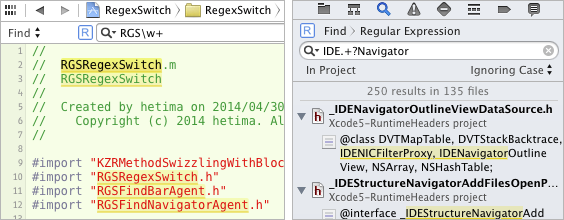

# RegexSwitch

RegexSwitch is plugin for Xcode 6.0 which helps switching find option between normal textual search and regular expression.

A small button is appeared aside search field. Clicking this button switches find option quickly.  
It indicates current state.

-  regex is on
-  regex is off

##Installation
Download project, build, relaunch Xcode.  
RegexSwitch.xcplugin will be installed in  
 `~/Library/Application Support/Developer/Shared/Xcode/Plug-ins`

## Author
http://hetima.com/  
https://twitter.com/hetima

## License 
MIT License. Copyright (c) 2014 hetima
